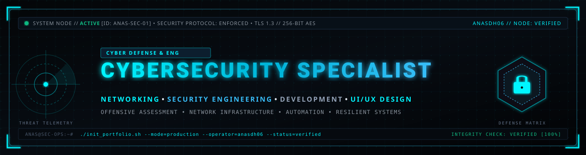
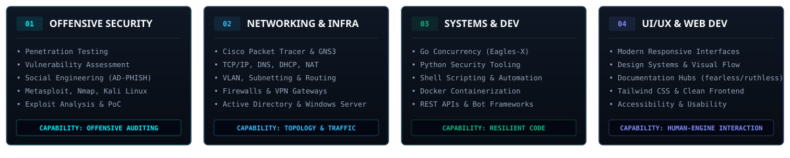

<div align="center">

<!-- HERO BANNER -->
<a href="https://github.com/anasdh06">
  
</a>

<br/>

<!-- SYSTEM STATUS STRIP -->
<p align="center">
  
  
  
  
  
</p>

<!-- NAVIGATION BAR -->
<p align="center">
  <a href="#executive-briefing"><code>[01_EXECUTIVE_BRIEF]</code></a> •
  <a href="#cybersecurity-specialization"><code>[02_CYBER_DOMAINS]</code></a> •
  <a href="#networking--infrastructure"><code>[03_NETWORK_INFRA]</code></a> •
  <a href="#development--engineering"><code>[04_SYSTEMS_ENG]</code></a> •
  <a href="#uiux-interface-engineering"><code>[05_UI_UX]</code></a> •
  <a href="#featured-operations"><code>[06_OPERATIONS]</code></a> •
  <a href="#technical-arsenal"><code>[07_ARSENAL]</code></a> •
  <a href="#telemetry--analytics"><code>[08_TELEMETRY]</code></a> •
  <a href="#secure-uplink"><code>[09_UPLINK]</code></a>
</p>

---

</div>

<br/>

##  01 // Executive Briefing

```yaml
Operator       : Anaaas (anasdh06)
Primary Domain : Cybersecurity Specialist & Security Engineering
Core Pillars   : Offensive Assessments • Network Architecture • Systems Automation • Human Interface (UI/UX)
Methodology    : Zero-Trust Principles • Empirical Stress Testing • Threat Surface Minimization
Workstation    : Hardened Linux / Windows Server Labs • Cisco Packet Tracer • GNS3 • VirtualBox
```

I am a **Cybersecurity Specialist** and **Systems Engineer** who operates at the intersection of offensive security assessment, robust network architecture, and security-oriented software engineering. My technical approach bridges deep infrastructure understanding with proactive vulnerability discovery and precision tooling.

- 🛡️ **Defensive & Offensive Mastery**: Designing threat-resistant architectures, conducting social engineering evaluations, analyzing network traffic down to packet headers, and automating vulnerability assessments.
- 🌐 **Network Engineering & Infrastructure**: Hands-on topology design and protocol simulation in **Cisco Packet Tracer** and **GNS3**, spanning VLAN segmentation, enterprise routing, firewall policy enforcement, and Active Directory administration.
- ⚡ **High-Performance Tooling**: Developing concurrent network stress-testing engines and automation scripts in **Go** and **Python**, optimizing thread pools into lightweight goroutines for maximum throughput.
- 🎨 **Interface & Product Ergonomics**: Designing clean, accessible, dark-themed user experiences and documentation hubs with **Tailwind CSS**, **HTML5/CSS3**, and **Figma** principles that make complex technical systems intuitive.

---

##  02 // Cybersecurity Specialization

My security practice is divided into four operational disciplines, emphasizing reproducible assessments and architectural resilience:

<p align="center">
  
</p>

### Operational Breakdown:

```
┌───────────────────────────────────────┬───────────────────────────────────────┐
│ OFFENSIVE SECURITY & ASSESSMENT       │ NETWORK & PERIMETER DEFENSE           │
├───────────────────────────────────────┼───────────────────────────────────────┤
│ • Penetration Testing & Vulnerability │ • Packet Inspection & Flow Analysis   │
│   Scrutiny (Nmap, Metasploit, Kali)   │ • Firewall Configuration & Policy     │
│ • Credential Harvesting & Phishing    │ • Enterprise VLAN & Subnet Isolation  │
│   Assessment Simulation (AD-PHISH)    │ • VPN Tunnels & Encrypted Gateways    │
│ • Exploit Verification & PoC Scripts  │ • DoS/DDoS Mitigation Testing         │
├───────────────────────────────────────┼───────────────────────────────────────┤
│ WEB APPLICATION SECURITY              │ DEFENSIVE HARDENING & AUDIT           │
├───────────────────────────────────────┼───────────────────────────────────────┤
│ • OWASP Top 10 Identification         │ • Active Directory User Provisioning  │
│ • Authentication Flow & Session Audit │ • Baseline System Hardening (Linux/Win│
│ • API Security & Token Validation     │ • Virtualized Lab Isolation (VBox)    │
│ • Injection Prevention & Sanitization │ • Log Auditing & Anomaly Correlation  │
└───────────────────────────────────────┴───────────────────────────────────────┘
```

---

##  03 // Networking & Infrastructure

Networking is the foundational backbone of effective cybersecurity. I design, simulate, and stress-test enterprise networks using industry-standard simulation and virtualization platforms.

<table>
  <tr>
    <td width="50%" valign="top">
      <h4>🌐 Network Simulation &amp; Lab Architecture</h4>
      <ul>
        <li><b>Cisco Packet Tracer 8.2 &amp; GNS3</b>: Building multi-subnet enterprise topologies, configuring managed switches, core routers, and virtual appliances.</li>
        <li><b>Routing &amp; Switching</b>: Static routing, RIP/OSPF fundamentals, inter-VLAN routing, trunking (802.1Q), and spanning tree protocols.</li>
        <li><b>Core IP Protocols</b>: Deep comprehension of TCP/IP, UDP, ICMP, ARP, DNS, DHCP, and NAT/PAT translation behaviors.</li>
      </ul>
    </td>
    <td width="50%" valign="top">
      <h4>🖥️ Systems Administration &amp; Identity</h4>
      <ul>
        <li><b>Active Directory &amp; Windows Server</b>: User import and security group provisioning (<code>ImportUsers.csv</code>), role-based access control, and policy enforcement.</li>
        <li><b>Virtualization Security</b>: Isolated dual-homed sandbox environments in <b>Oracle VirtualBox</b> for malware examination and offensive tool testing.</li>
        <li><b>Hardening</b>: Disabling insecure services, enforcing SSH key authentication, and auditing port exposures.</li>
      </ul>
    </td>
  </tr>
</table>

---

##  04 // Development & Engineering

I write purposeful software to automate repetitive tasks, simulate hostile network scenarios, and build platforms with high concurrent throughput.

- **Golang Concurrency**: Porting traditional multi-threaded architectures to Go goroutines. Engineered `Eagles-X` to achieve thousands of lightweight concurrent network connections with minimal memory and CPU overhead compared to thread-based runtimes.
- **Python Automation**: Writing offensive reconnaissance tools, multi-threaded scripts, web scrapers, and Discord application bots (`discord.py`, `FastAPI`).
- **Containerization & Shell**: Crafting reproducible `Dockerfiles` and Linux `bash` installation routines that bundle complex security toolkits with zero host pollution.
- **API & Backend Systems**: Designing clean REST interfaces, asynchronous event handlers, and data pipelines for infrastructure telemetry.

---

##  05 // UI/UX & Interface Engineering

Exceptional security tools require intuitive interfaces. I apply UI/UX principles to transform complex security metrics and documentation into clean, ergonomic digital products.

<table>
  <tr>
    <td width="33%" align="center">
      <h4>🎨 Design Systems</h4>
      <p>Component hierarchy, accessible contrast ratios (WCAG 2.1 AA), responsive grid systems, and disciplined typography palettes.</p>
    </td>
    <td width="33%" align="center">
      <h4>💻 Modern Web Portals</h4>
      <p>Production documentation hubs (<code>fearless-docs</code>, <code>ruthless-docs</code>) built with semantic HTML5, fluid CSS3, and JavaScript.</p>
    </td>
    <td width="33%" align="center">
      <h4>⚡ Dashboard Interfaces</h4>
      <p>Clean management dashboards paired with backend bots using Tailwind CSS, responsive sidebars, and status indicators.</p>
    </td>
  </tr>
</table>

---

##  06 // Featured Operations & Projects

Here are select public repositories demonstrating capabilities in offensive assessment, high-throughput network engineering, and production web systems:

<br/>

### 01. AD-PHISH // Social Engineering Assessment Framework
> **Primary Domain**: Offensive Security • Awareness Simulation • Containerization

<p align="center">
  <a href="https://github.com/anasdh06/AD-PHISH">
    
  </a>
</p>

- **Description**: An automated social engineering and credential-harvesting awareness framework featuring 30+ responsive authentication templates. Built to demonstrate the mechanics of modern phishing vectors to enterprise security teams.
- **Security Relevance**: Evaluates human perimeter defenses, analyzes header manipulation, and reinforces organizational training on credential theft prevention.
- **Technologies**: `Hack` • `PHP` • `Shell` • `HTML5 / CSS3` • `Docker`
- **Links**: [Repository & Code](https://github.com/anasdh06/AD-PHISH) • [Documentation](https://github.com/anasdh06/AD-PHISH#readme)

<br/>

### 02. Eagles-X // High-Throughput Network Stress Engine
> **Primary Domain**: Network Security • Concurrency Architecture • Infrastructure Testing

<p align="center">
  <a href="https://github.com/anasdh06/Eagles-X">
    
  </a>
</p>

- **Description**: A concurrent HTTP connection pool and resource exhaustion assessment tool ported from multi-threaded Python to Golang. Replaced resource-heavy OS threads with lightweight Go goroutines for extreme connection density.
- **Security Relevance**: Used to empirically verify web application firewalls (WAF), load balancer limits, and reverse-proxy resilience against Layer 7 connection depletion.
- **Technologies**: `Go (Golang)` • `Python` • `EAGLESMAXPROCS` • `TCP/HTTP Sockets`
- **Links**: [Repository & Code](https://github.com/anasdh06/Eagles-X) • [Architecture Guide](https://github.com/anasdh06/Eagles-X#readme)

<br/>

### 03. Fearless & Ruthless // Platform Documentation Ecosystem
> **Primary Domain**: UI/UX Design • Web Development • Public Infrastructure

<p align="center">
  <a href="https://github.com/anasdh06/fearless-docs">
    
  </a>
</p>

- **Description**: Production documentation hubs and legal policy portals designed for bot platforms. Hosted via GitHub Pages, featuring custom layouts, typography hierarchy, responsive navigation, and dark aesthetics.
- **Security Relevance**: Transparent policy communication, Terms of Service enforcement, and user data privacy disclosures conforming to platform guidelines.
- **Technologies**: `HTML5` • `CSS3` • `JavaScript` • `GitHub Pages`
- **Live Portals**: [Fearless Docs](https://anasdh06.github.io/fearless-docs/) • [Ruthless Docs](https://anasdh06.github.io/ruthless-docs/)

---

##  07 // Technical Arsenal

A disciplined matrix of verified technologies and security instrumentation:

<table>
  <thead>
    <tr>
      <th align="left">Category</th>
      <th align="left">Technologies &amp; Frameworks</th>
    </tr>
  </thead>
  <tbody>
    <tr>
      <td><b>🛡️ Security &amp; Assessment</b></td>
      <td>
        
        
        
        
        
        
      </td>
    </tr>
    <tr>
      <td><b>🌐 Networking &amp; Infra</b></td>
      <td>
        
        
        
        
        
        
      </td>
    </tr>
    <tr>
      <td><b>⚡ Languages &amp; Runtimes</b></td>
      <td>
        
        
        
        
        
      </td>
    </tr>
    <tr>
      <td><b>💻 Web &amp; UI/UX Stack</b></td>
      <td>
        
        
        
        
        
      </td>
    </tr>
    <tr>
      <td><b>🔧 DevOps &amp; Tooling</b></td>
      <td>
        
        
        
        
        
      </td>
    </tr>
  </tbody>
</table>

---

##  08 // Telemetry & Analytics

Real-time GitHub activity metrics calibrated with customized command-center color schemes:

<div align="center">

<table border="0">
  <tr>
    <td align="center" width="50%">
      
    </td>
    <td align="center" width="50%">
      
    </td>
  </tr>
  <tr>
    <td colspan="2" align="center">
      <br/>
      
    </td>
  </tr>
</table>

</div>

---

##  09 // Secure Uplink & Communications

Looking to collaborate on security assessments, network engineering projects, or high-performance tool development? Initiate contact through official channels:

<div align="center">

<p align="center">
  &nbsp;&nbsp;
  <a href="https://github.com/anasdh06">
    
  </a>
  &nbsp;&nbsp;
  &nbsp;&nbsp;
  <a href="https://discord.com">
    
  </a>
</p>

<br/>

```
[SYSTEM ENDPOINT] :: HOST: anasdh06 :: CONNECTION TERMINATED SUCCESSFULLY :: 2026
```

</div>
